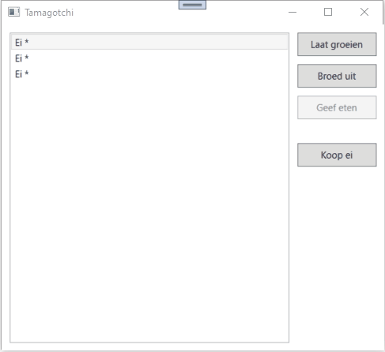
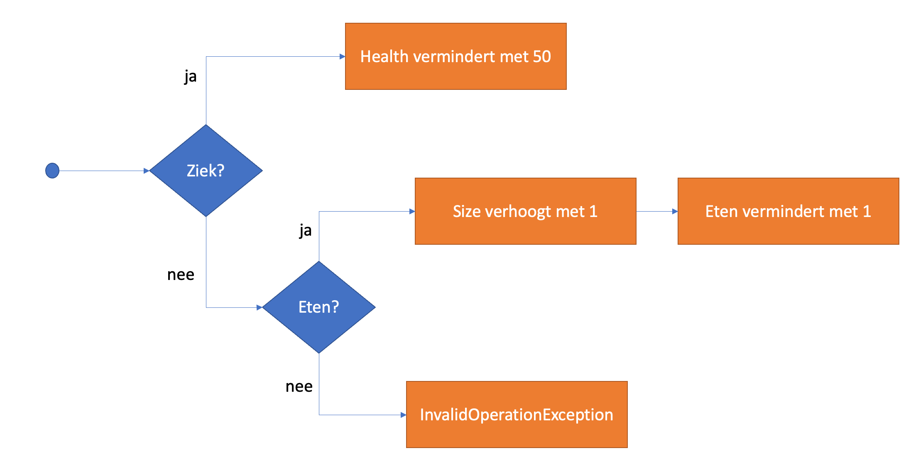
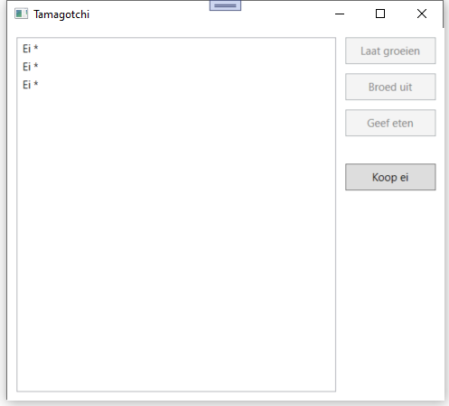
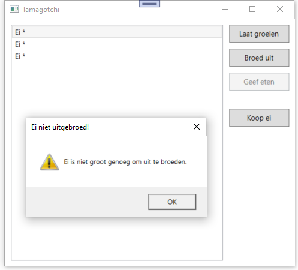
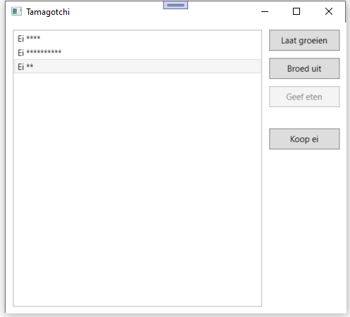
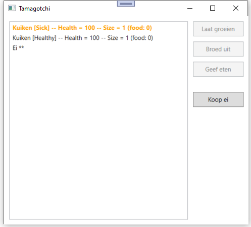
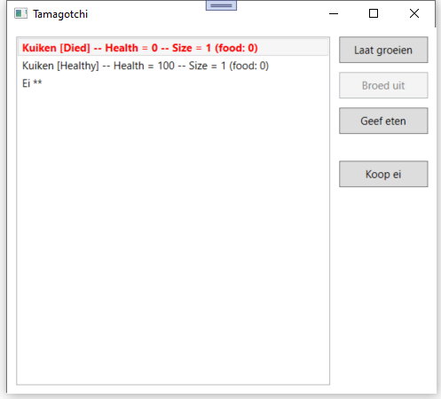
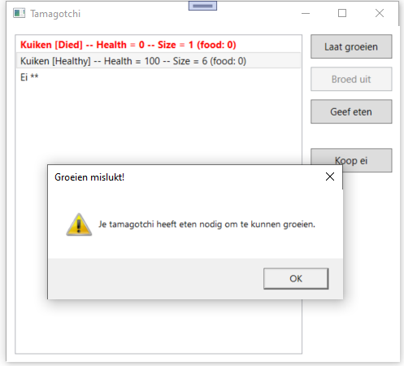
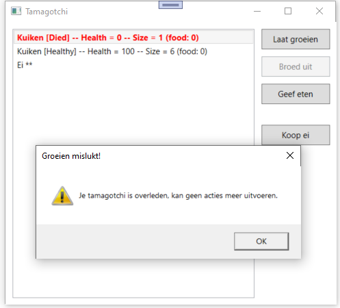

# Eindexamen Programming Advanced

Voor deze opdracht keren we terug naar de [Tamagotchi](https://nl.wikipedia.org/wiki/Tamagotchi)-rage uit de jaren '90.
Velen van jullie zijn wellicht te jong, maar wie toen opgroeide of zelf al kinderen had, zal zich de kleurrijke digitale sleuterhangers zeker nog herinneren.

Een Tamagotchi is een virtueel huisdier dat start als een ei en opgroeit naarmate je er voor zorgt.
Het is de bedoeling om deze zo lang mogelijk in leven en goede gezondheid te houden.
In deze examenopdracht werken we een heel basis applicatie uit die hierop gebaseerd is.

## De bedoeling van het programma

We werken een WPF app uit waarin we een collectie Tamagotchi kunnen beheren.
De Tamagotchi's en hun eigenschappen worden opgelijst.
Elke Tamagotchi start als een ei en kan uitgebroed worden tot een kuiken (verder gaan we in deze app niet).
Je kan op verschillende manieren interageren met de geselecteerde Tamagotchi:
- Laat groeien
- Broed uit (enkel van toepassing op eieren)
- Geef eten (enkel voor kuikens)

Daarnaast kan je een nieuw Tamagotchi-ei aankopen (= toevoegen aan je collectie).
Bij opstarten van het programma zijn reeds drie eieren aanwezig.
Bekijk eerst onderstaande animatie van het eindresultaat.

## Class library

De start solution bevat reeds een class library met enkele mappen en bestanden.
De interfaces zijn reeds volledig door ons voorzien.
De klassen en enum zijn vooralsnog leeg en zal je zelf van de juiste inhoud meoten voorzien.

### Interfaces
Er zijn reeds drie interfaces aanwezig. **Deze interfaces pas je NIET aan.**
- `ITamagotchi`: de basisinterface waaraan elke Tamagotchi moet voldoen.
- `IHatchable`: bijkomende interface voor Tamagotchi die uitgebroed kan worden (een ei).
- `IFeedable`: bijkomende interface voor Tamagotchi die gevoederd kan worden (een kuiken).

**ITamagotchi**

De basisinterface bevat drie (**read-only**) properties:
- `int Health`: de gezondheid.
- `int Size`: de grootte.
- `TamagotchiStatus Status`: geeft aan of de Tamagotchi gezond, ziek of overleden is (zie verder).

Er is ook een methode voorzien:
- `void Grow()`: laat groeien.

**IHatchable**

Een Tamagotchi die uitgebroed kan worden (in wezen een ei) heeft een extra methode:
- `Chick Hatch()`: door het ei uit te broeden, komt er een kuiken tevoorschijn.

**IFeedable**

Ook deze interface legt een extra methode op:
- `void Feed()`: voeder de Tamagotchi.

### Enum
In de map **Enums** staat een (nog lege) enum `TamagotchiStatus`.
Vul deze aan zodat er drie mogelijke waarden zijn:
- `Healthy`
- `Sick`
- `Died`

### Entiteiten
Er zijn twee soorten Tamagotchi's: eieren en kuikens (die uit de eieren komen).
Beiden delen wat gemeenschappelijke logica, hiervoor wordt een abstracte basisklasse voorzien.
Vul de basisklasse `Tamagotchi` en de twee concrete subklasse `Egg` en `Chick` aan zoals beschreven.

**Tamagotchi**

Abstracte basisklasse die `ITamagotchi` implementeert.
De properties `Health`, `Size` en `Status` worden hier voorzien.
Houd hierbij rekening met deze aandachtspunten:
- Elk van de properties mag enkel aangepast worden vanuit de klasse `Tamagotchi` of **een van haar subklassen**.
- De `Health` mag nooit onder nul kunnen zakken. Negatieve waarden worden naar nul herleid.
  Zodra de `Health` op nul komt, moet automatisch ook de `Status` op `Died` gezet worden.
- Een Tamagotchi kan enkel **groeien**.
  Bij een aanpassing van `Size` moet de nieuwe waarde dus steeds groter zijn dan de huidige waarde.
  Zo niet, dan blijft de huidige waarde behouden.

Zorg voor deze initiële waarden:
- `Health`: 100
- `Size`: 1
- `Status`: `Healthy`

Het moet ook mogelijk zijn om een `Tamagotchi` aan te maken die meteen ziek (status `Sick`) is.

De methode `Grow()` die opgelegd wordt door de interface, wordt hier nog **niet** van een implementatie voorzien.
Stel de implementatie uit tot in de subklassen `Egg` en `Chick`.

**Egg**

Erft over van `Tamagotchi` en implementeert de interface `IHatchable`.
Implementeer de methode `Grow()` en `Hatch()` volgens de betreffende interfaces:
- `Grow()`: de `Size` gaat met 1 omhoog.
- `Hatch()`: effect is afhankelijk van de grootte (`Size`) van het ei:
  - Grootte **kleiner dan 3**: ei kan niet uitgebroed worden. Gooi een `InvalidOperationException` met gepaste boodschap.
  - Grootte **minstens 3** maar **kleiner dan 6**: er komt een kuiken uit het ei dat met **50% kans ziek** is.
  - Grootte **minstens 6**: er komt altijd een **gezond** kuiken uit het ei.

De methode `Hatch()` geeft een nieuwe instantie van `Chick` terug:
deze instantie stelt het kuiken dat uit het ei kwam voor(tenzij er een exceptie gesmeten werd natuurlijk).

Voorzie tevens een `ToString()` override zodat een ei in de listbox getoond word zoals in de animatie en screenshots.
We zien de tekst `"Ei"` gevolgd door een spatie en een aantal sterretjes (`"*"`) dat overeenkomt met de grootte van het ei.
Bv. een ei met groote 4 zal getoond worden als: `"Ei ****"`.

**Chick**

Erft ook over van `Tamagotchi` en implementeert daarnaast de interface `IFeedable`.
Implementeer de methoden volgens de betreffende interfaces:
- `Feed()`: geef het kuiken eten. Hou intern in de klasse de hoeveelheid eten bij die het kuiken reeds kreeg en verhoog dit hier met 1.
- `Grow()`: indien het kuiken ziek is (status = `Sick`) en we het toch vragen om te groeien, dan zakt de `Health` met 50 (ongeacht of het reeds eten kreeg). Is het kuiken niet ziek, dan wordt de `Size` met 1 verhoogd, **op voorwaarde** dat het kuiken nog eten in voorraad heeft (vooraf toegediend via de methode `Feed()`). De hoeveelheid eten van het kuiken vermindert dan ook met 1. Is het eten op? Dan wordt een `InvalidOperationException` gegooid met gepaste boodschap. **Kijk goed naar de animatie bovenaan, daar zie je de wisselwerking tussen voederen en groeien in werking.** Onderstaande flowchart licht dit ook verder toe:

**Let op:** indien het kuiken overleden is, kan je er geen acties meer op uitvoeren.
De methoden `Feed()` en `Grow()` moeten beiden een `InvalidOperationException` gooien met gepaste boodschap, indien de Tamagotchi reeds overleden is.
**Denk erover na hoe je hier codeduplicatie kan vermijden.**

Voorzie een constructor waar je aan kan meegeven of het kuiken ziek is of niet.
Een kuiken start altijd met `Health` 100 (ziek of niet ziek).
Dit werd hierboven al zo gevraagd voor de basisklasse `Tamagotchi` en hoeft hier dus niet aangepast te worden.
De intern bijgehouden hoeveelheid eten die het kuiken nog in voorraad heeft, is initieel 0.

Voorzie tevens een `ToString()` override zodat een kuiken in de listbox getoond word zoals in de animatie en screenshots.

### Sturende klasse
Tenslotte implementeer je de sturende klasse `TamagotchiCollection` (map **services**).
Deze beheert de lijst van Tamagotchis in de (**read-only**) property:
- `List<ITamagotchi> Tamagotchis`

Voorzie een methode `Hatch(Egg)` om een gegeven ei uit te broeden.
**Belangrijk:** het uitgebroedde ei moet verwijderd worden uit de lijst `Tamagotchis` en vervangen worden door het kuiken dat uit het ei kwam, op **dezelfde positie** in de lijst.
Zo is het voor de gebruiker duidelijk welk kuiken uit welk ei gekomen is.

Voorzie tevens een methode `AddEggs(int)` om een gegeven aantal eieren toe te voegen aan de verzameling.
Wanneer de `TamagotchiCollection` wordt aangemaakt, worden standaard 3 eieren in de collectie voorzien.

## WPF Applicatie
De XAML werd door ons al volledig voorzien.
De code behind moet je zelf nog implementeren en mag je naar believen organiseren.

**Denk eraan dat veel acties kunnen falen (om verschillende redenen).**
Zorg ervoor dat je applicatie **NOOIT crasht** maar steeds een duidelijke melding geeft aan de gebruiker.

Zorg ervoor dat bij het opstarten van de applicatie de Tamagothi's uit de collectie getoond worden in de listbox.
Initieel zullen dat dus drie eieren zijn.

Voorzie de nodige event handlers voor de knoppen die acties uitvoeren op de geselecteerde Tamagotchi:
- **Laat groeien**: gebruik de methode `Grow()` om de geselecteerde Tamagotchi te laten groeien.
- **Broed uit**: broed een ei uit. **Belangrijk:** gebruik hier zeker de methode `Hatch(Egg)` van de `TamagotchiCollection` (en **niet** rechtstreeks deze van het ei zelf). Het ei moet in de collectie immers vervangen worden door het kuiken dat er uit kwam.
- **Geef eten**: geef een kuiken eten via de methode `Feed()`.

Voorzie ook de event handler voor de knop **Koop ei**: deze voegt één ei toe aan de collectie, via de methode `AddEggs(int)` van `TamagotchiCollection`.

**Tot slot:** de knop **Broed uit** is enkel toepasselijk voor `IHatchable`s en **Geef eten** enkel voor `IFeedable`s.
Zorg ervoor dat deze knoppen dan ook enkel actief (klikbaar) zijn als er een Tamagotchi van het gepaste soort is geselecteerd.

## Screenshots

**Applicatie na opstarten**.
Er zijn drie eieren aanwezig van grootte 1.

**Eieren te klein om uit te broeden.**
De eieren starten met grootte 1.
Ze kunnen pas uitgebroed worden vanaf grootte 3 (met risico op ziek kuiken).
Vanaf grootte 6 is het kuiken met zekerheid gezond.

**De eieren zijn gegroeid.**
We hebben onze eieren laten groeien tot respectievelijk grootte 4, 10 en 2.
De eerste twee eieren kunnen nu uitgebroed worden.
Bij het eerste ei riskeren we wel een ziek kuiken.

**De eerste twee eieren zijn uitgebroed**.
Het eerste van de twee kuikens is ziek uit het ei gekomen.

**De eerste Tamagotchi is overleden**.
Deze werd ziek geboren.
Door meermaals het kuiken proberen te laten groeien, is het gestorven.

**Het nog levende kuiken is gegroeid.**
We hebben hiervoor eerst meermaals eten gegeven (vijf keer om precies te zijn).
Vervolgens klikten we drie keer op **Laat groeien**.
Hierdoor heeft het kuiken nu grootte vier bereikt (het was gestart met grootte 1) met nog twee (= 5 - 3) dosissen eten op voorraad.

**Het eten is op!**
We proberen het kuiken te laten groeien maar het heeft geen eten meer op voorrad.
We moeten het dus eerst opnieuw voederen.

**Een gestorven Tamagotchi kan geen acties meer uitvoeren.**

